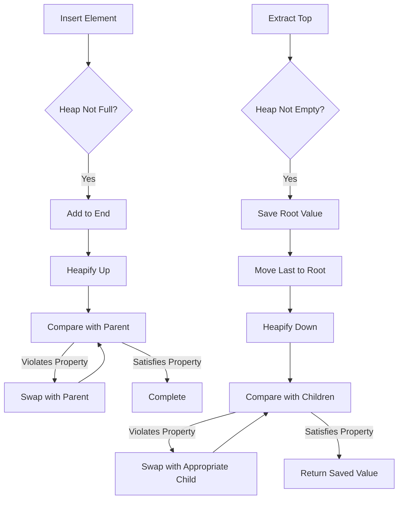
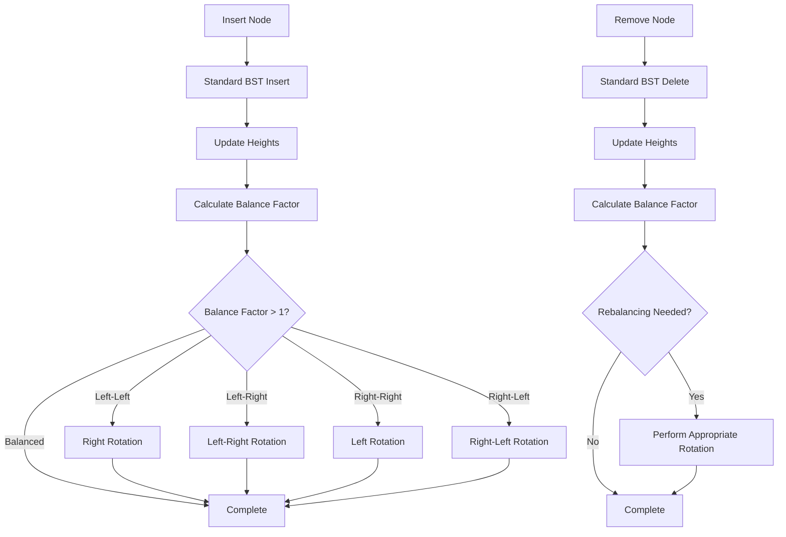
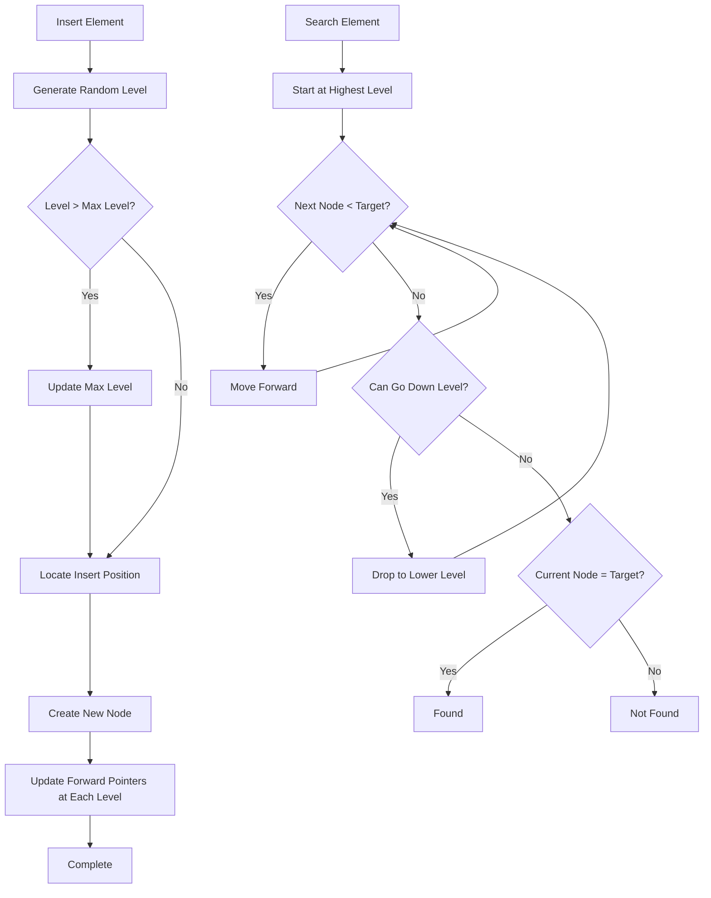

# Data Structure Enhancement Design

## Objective

Enhance the data_structures module by adding three advanced data structures: Heap (Binary Heap), Balanced Tree (AVL Tree), and Skip List. Each data structure will follow the existing project patterns with comprehensive test coverage.

## Background

The current data_structures module contains basic structures (LinkedList, Stack, Queue) implemented with smart pointers and modern C++ practices. This enhancement extends the module with advanced structures commonly used in algorithm implementations and system design.

## Scope

### In Scope
- Binary Heap implementation (Min-Heap and Max-Heap support)
- AVL Tree implementation (self-balancing binary search tree)
- Skip List implementation (probabilistic data structure)
- Comprehensive unit tests for all three structures
- Integration with existing module structure and build system

### Out of Scope
- Red-Black Tree or other balanced tree variants
- Advanced heap variants (Fibonacci Heap, Binomial Heap)
- Thread-safe implementations
- Persistence or serialization features

## Design Overview

The enhancement adds three new data structures to the existing module while maintaining consistency with current implementation patterns:

- Smart pointer usage for memory management
- Template-based generic implementations
- Header-only approach for template classes
- Consistent API design patterns
- Return value conventions using std::optional where appropriate

## Component Design

### 1. Binary Heap

#### Purpose
Provide efficient priority queue operations with O(log n) insertion and extraction, supporting both min-heap and max-heap configurations.

#### Structure Overview

The heap will be implemented using a vector-based complete binary tree with configurable comparison strategy.

#### Key Behaviors

| Operation | Expected Behavior | Time Complexity |
|-----------|-------------------|-----------------|
| Insert | Add element while maintaining heap property | O(log n) |
| Extract Top | Remove and return root element | O(log n) |
| Peek Top | View root element without removal | O(1) |
| Build Heap | Construct heap from collection of elements | O(n) |
| Heapify | Restore heap property after modification | O(log n) |
| Size | Return number of elements | O(1) |
| Empty | Check if heap is empty | O(1) |
| Clear | Remove all elements | O(1) |

#### Data Model

| Attribute | Type | Description |
|-----------|------|-------------|
| data | vector of elements | Underlying storage for heap elements |
| comparator | comparison function | Determines min-heap or max-heap behavior |
| size | size_t | Number of elements in heap |

#### Processing Flow



### 2. AVL Tree

#### Purpose
Provide balanced binary search tree with guaranteed O(log n) operations through automatic rotation-based rebalancing.

#### Structure Overview

A self-balancing binary search tree where the height difference between left and right subtrees of any node is at most one.

#### Key Behaviors

| Operation | Expected Behavior | Time Complexity |
|-----------|-------------------|-----------------|
| Insert | Add element and rebalance if needed | O(log n) |
| Remove | Delete element and rebalance if needed | O(log n) |
| Search | Find element in tree | O(log n) |
| Find Min | Locate minimum element | O(log n) |
| Find Max | Locate maximum element | O(log n) |
| In-order Traverse | Visit nodes in sorted order | O(n) |
| Height | Get tree height | O(1) |
| Size | Return number of nodes | O(1) |
| Clear | Remove all nodes | O(n) |

#### Data Model

| Attribute | Type | Description |
|-----------|------|-------------|
| Node Structure | TreeNode | Contains data, left/right pointers, height |
| root | shared_ptr to TreeNode | Root of the tree |
| size | size_t | Number of nodes in tree |

#### Processing Flow



#### Rotation Strategy

The AVL tree maintains balance through four rotation types:

| Imbalance Type | Rotation Strategy | Description |
|----------------|-------------------|-------------|
| Left-Left | Single Right Rotation | Left subtree of left child is taller |
| Right-Right | Single Left Rotation | Right subtree of right child is taller |
| Left-Right | Double Rotation (Left then Right) | Right subtree of left child is taller |
| Right-Left | Double Rotation (Right then Left) | Left subtree of right child is taller |

### 3. Skip List

#### Purpose
Provide probabilistic alternative to balanced trees with simpler implementation while maintaining O(log n) expected time for search, insertion, and deletion.

#### Structure Overview

A multi-level linked list where each level serves as an express lane for the levels below, with probabilistic level assignment.

#### Key Behaviors

| Operation | Expected Behavior | Time Complexity (Expected) |
|-----------|-------------------|----------------------------|
| Insert | Add element with random level assignment | O(log n) |
| Remove | Delete element from all levels | O(log n) |
| Search | Find element using skip mechanism | O(log n) |
| Size | Return number of elements | O(1) |
| Clear | Remove all elements and levels | O(n) |
| Max Level | Get current maximum level | O(1) |

#### Data Model

| Attribute | Type | Description |
|-----------|------|-------------|
| Node Structure | SkipNode | Contains data and array of forward pointers |
| header | shared_ptr to SkipNode | Sentinel head node |
| max_level | int | Current maximum level in list |
| level_probability | float | Probability for level promotion (default 0.5) |
| size | size_t | Number of elements |

#### Processing Flow



#### Level Assignment Strategy

The skip list uses probabilistic level assignment:
- Each element starts at level 0
- With probability p (default 0.5), promote to next level
- Continue until promotion fails or maximum level reached
- Maximum level capped at log(n) to maintain efficiency

## File Organization

### Header Files

| File | Location | Purpose |
|------|----------|---------|
| heap.h | src/data_structures/include/data_structures/ | Binary heap template class |
| avl_tree.h | src/data_structures/include/data_structures/ | AVL tree template class |
| skip_list.h | src/data_structures/include/data_structures/ | Skip list template class |

### Source Files

| File | Location | Purpose |
|------|----------|---------|
| heap.cpp | src/data_structures/src/ | Explicit template instantiations if needed |
| avl_tree.cpp | src/data_structures/src/ | Explicit template instantiations if needed |
| skip_list.cpp | src/data_structures/src/ | Explicit template instantiations if needed |

### Test Files

| File | Location | Purpose |
|------|----------|---------|
| test_heap.cpp | tests/data_structures/ | Heap unit tests |
| test_avl_tree.cpp | tests/data_structures/ | AVL tree unit tests |
| test_skip_list.cpp | tests/data_structures/ | Skip list unit tests |

## Test Strategy

### Coverage Requirements

Each data structure requires comprehensive test coverage following existing patterns:

#### Heap Test Cases
- Basic operations (insert, extract, peek)
- Min-heap and max-heap configurations
- Build heap from collection
- Empty heap operations
- Edge cases (single element, duplicate values)
- Type compatibility (int, string, custom types)
- Heap property verification after operations

#### AVL Tree Test Cases
- Basic operations (insert, remove, search)
- Automatic rebalancing verification
- All rotation types (LL, RR, LR, RL)
- Tree height validation
- In-order traversal correctness
- Empty tree operations
- Edge cases (single node, duplicate prevention)
- Type compatibility testing
- Balance factor verification

#### Skip List Test Cases
- Basic operations (insert, remove, search)
- Level generation randomness
- Search efficiency validation
- Empty list operations
- Edge cases (duplicate handling, boundaries)
- Type compatibility testing
- Level structure integrity
- Large dataset performance characteristics

### Test Patterns

Following existing test structure:
- Use Google Test framework
- Group related tests with TEST macros
- Include positive and negative test cases
- Test with multiple data types
- Verify state after each operation
- Test boundary conditions
- Validate return values and optional types

## Build Integration

### CMakeLists.txt Modifications

The data_structures/CMakeLists.txt will be updated to include new source files:
- Add heap.cpp to library sources
- Add avl_tree.cpp to library sources
- Add skip_list.cpp to library sources

The tests/CMakeLists.txt will be updated to include new test files:
- Add test_heap.cpp to test executable
- Add test_avl_tree.cpp to test executable
- Add test_skip_list.cpp to test executable

## Implementation Considerations

### Memory Management
- Use std::shared_ptr for tree and skip list node management
- Use std::vector for heap storage (automatic memory management)
- Ensure proper cleanup in destructors and clear methods
- Avoid memory leaks through smart pointer usage

### Type Requirements
- Support any type with comparison operators (operator<, operator==)
- Use template constraints where appropriate
- Provide clear compilation errors for incompatible types

### API Consistency
- Return std::optional for operations that may fail
- Return bool for operations indicating success/failure
- Use const correctness throughout
- Follow existing naming conventions (camelCase for methods)

### Performance Characteristics
- Heap: O(log n) insertion/extraction, O(n) build
- AVL Tree: O(log n) for all operations, strict balance guarantee
- Skip List: O(log n) expected time, simpler implementation than trees

### Edge Case Handling
- Empty structure operations should return appropriate defaults
- Duplicate handling should be clearly defined
- Boundary conditions should not cause undefined behavior
- Invalid operations should return error indicators

## Validation Criteria

The enhancement is complete when:

1. All three data structures are implemented with template support
2. Each structure follows existing code style and patterns
3. Smart pointers are used appropriately
4. All header files are properly included in public interface
5. CMakeLists.txt files are updated correctly
6. All test files are created and pass
7. Test coverage includes all major operations and edge cases
8. Each test suite has minimum 8 test cases
9. Build system compiles all components without warnings
10. No memory leaks detected in test execution
    L --> K
    K -->|No| M{Can Go Down Level?}
    M -->|Yes| N[Drop to Lower Level]
    N --> K
    M -->|No| O{Current Node = Target?}
    O -->|Yes| P[Found]
    O -->|No| Q[Not Found]
```

#### Level Assignment Strategy

The skip list uses probabilistic level assignment:
- Each element starts at level 0
- With probability p (default 0.5), promote to next level
- Continue until promotion fails or maximum level reached
- Maximum level capped at log(n) to maintain efficiency

## File Organization

### Header Files

| File | Location | Purpose |
|------|----------|---------|
| heap.h | src/data_structures/include/data_structures/ | Binary heap template class |
| avl_tree.h | src/data_structures/include/data_structures/ | AVL tree template class |
| skip_list.h | src/data_structures/include/data_structures/ | Skip list template class |

### Source Files

| File | Location | Purpose |
|------|----------|---------|
| heap.cpp | src/data_structures/src/ | Explicit template instantiations if needed |
| avl_tree.cpp | src/data_structures/src/ | Explicit template instantiations if needed |
| skip_list.cpp | src/data_structures/src/ | Explicit template instantiations if needed |

### Test Files

| File | Location | Purpose |
|------|----------|---------|
| test_heap.cpp | tests/data_structures/ | Heap unit tests |
| test_avl_tree.cpp | tests/data_structures/ | AVL tree unit tests |
| test_skip_list.cpp | tests/data_structures/ | Skip list unit tests |

## Test Strategy

### Coverage Requirements

Each data structure requires comprehensive test coverage following existing patterns:

#### Heap Test Cases
- Basic operations (insert, extract, peek)
- Min-heap and max-heap configurations
- Build heap from collection
- Empty heap operations
- Edge cases (single element, duplicate values)
- Type compatibility (int, string, custom types)
- Heap property verification after operations

#### AVL Tree Test Cases
- Basic operations (insert, remove, search)
- Automatic rebalancing verification
- All rotation types (LL, RR, LR, RL)
- Tree height validation
- In-order traversal correctness
- Empty tree operations
- Edge cases (single node, duplicate prevention)
- Type compatibility testing
- Balance factor verification

#### Skip List Test Cases
- Basic operations (insert, remove, search)
- Level generation randomness
- Search efficiency validation
- Empty list operations
- Edge cases (duplicate handling, boundaries)
- Type compatibility testing
- Level structure integrity
- Large dataset performance characteristics

### Test Patterns

Following existing test structure:
- Use Google Test framework
- Group related tests with TEST macros
- Include positive and negative test cases
- Test with multiple data types
- Verify state after each operation
- Test boundary conditions
- Validate return values and optional types

## Build Integration

### CMakeLists.txt Modifications

The data_structures/CMakeLists.txt will be updated to include new source files:
- Add heap.cpp to library sources
- Add avl_tree.cpp to library sources
- Add skip_list.cpp to library sources

The tests/CMakeLists.txt will be updated to include new test files:
- Add test_heap.cpp to test executable
- Add test_avl_tree.cpp to test executable
- Add test_skip_list.cpp to test executable

## Implementation Considerations

### Memory Management
- Use std::shared_ptr for tree and skip list node management
- Use std::vector for heap storage (automatic memory management)
- Ensure proper cleanup in destructors and clear methods
- Avoid memory leaks through smart pointer usage

### Type Requirements
- Support any type with comparison operators (operator<, operator==)
- Use template constraints where appropriate
- Provide clear compilation errors for incompatible types

### API Consistency
- Return std::optional for operations that may fail
- Return bool for operations indicating success/failure
- Use const correctness throughout
- Follow existing naming conventions (camelCase for methods)

### Performance Characteristics
- Heap: O(log n) insertion/extraction, O(n) build
- AVL Tree: O(log n) for all operations, strict balance guarantee
- Skip List: O(log n) expected time, simpler implementation than trees

### Edge Case Handling
- Empty structure operations should return appropriate defaults
- Duplicate handling should be clearly defined
- Boundary conditions should not cause undefined behavior
- Invalid operations should return error indicators

## Validation Criteria

The enhancement is complete when:

1. All three data structures are implemented with template support
2. Each structure follows existing code style and patterns
3. Smart pointers are used appropriately
4. All header files are properly included in public interface
5. CMakeLists.txt files are updated correctly
6. All test files are created and pass
7. Test coverage includes all major operations and edge cases
8. Each test suite has minimum 8 test cases
9. Build system compiles all components without warnings
10. No memory leaks detected in test execution
